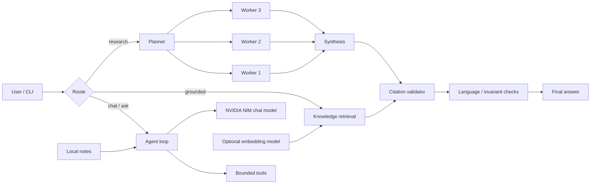

# FirstAI Grounded Agent

A bounded Arabic-first AI agent that combines NVIDIA NIM inference, tool calling, grounded retrieval, persistent user-approved notes, branched research, citation validation, and conservative language-quality recovery.

> Portfolio project. This repository is an independent educational implementation inspired by concepts taught in NVIDIA DLI's *Securing Agents with OpenShell and NemoClaw*. It is not an NVIDIA product, endorsement, or security certification.

## Why this project exists

Large-language-model demos often stop at a single prompt. FirstAI focuses on the engineering around the model: bounded execution, explicit tools, retrieval provenance, state management, recovery paths, and validation before an answer is shown.

The result is a compact reference implementation for studying how an AI agent can move from a raw model call to a more controlled application.

## Highlights

- Arabic-first command-line experience with bounded conversation history.
- NVIDIA NIM chat integration using `nvidia/nemotron-3-super-120b-a12b`.
- Local keyword retrieval with Arabic lexical normalization.
- Optional dense retrieval using `nvidia/llama-nemotron-embed-vl-1b-v2`.
- Grounded answers that can cite only retrieved source IDs.
- Safe calculator tool with a strict expression grammar and execution limits.
- User-controlled persistent notes stored locally.
- Branched research workflow: plan, independent workers, evidence-preserving synthesis, and resumable checkpoints.
- Request-budget enforcement across planning, workers, synthesis, and repair attempts.
- Language-quality recovery for mixed Arabic/Latin prose while preserving citations, numbers, URLs, and code.
- Secret-conscious API handling: keys are read from a hidden prompt or environment variable and are not persisted by the application.
- Offline demo and doctor commands for validation without a model call.
- 108 deterministic unit and regression tests.

## Architecture



The project distinguishes **context isolation** from **runtime isolation**. Independent research workers receive fresh contexts, but this does not sandbox processes, files, or network access. Runtime isolation requires a separately configured environment such as OpenShell, a container, or another policy-enforced runtime.

## Models

Default chat model:

```text
nvidia/nemotron-3-super-120b-a12b
```

Optional embedding model:

```text
nvidia/llama-nemotron-embed-vl-1b-v2
```

The application intentionally limits its own context and call budgets even when the underlying model supports larger limits.

## Requirements

- Python 3.12 or 3.13
- NVIDIA API key for live model calls
- No third-party Python dependency is required for the default CLI and test suite

Optional runtime-isolation tooling is external to this repository and is not enabled automatically.

## Quick start

Clone the repository and enter it:

```bash
git clone https://github.com/4hessa/first-ai-grounded-agent.git
cd first-ai-grounded-agent
```

Run the offline health check:

```bash
python -m first_ai doctor
```

Run the deterministic offline agent demo:

```bash
python -m first_ai demo
```

Run all tests:

```bash
python -m unittest discover -s tests -p "test_*.py" -v
```

For a live session, provide the key in your local shell and start chat:

```bash
export NVIDIA_API_KEY="your-key-here"
python -m first_ai chat
```

PowerShell:

```powershell
$env:NVIDIA_API_KEY = "your-key-here"
python3 -m first_ai chat
```

Do not commit an API key. `.gitignore` excludes common local-secret files and runtime state.

## CLI modes

| Command | Purpose | Network required |
| --- | --- | --- |
| `python -m first_ai doctor` | Validate config, Python version, corpus, and runtime-tool presence | No |
| `python -m first_ai demo` | Deterministic offline tool-loop demonstration | No |
| `python -m first_ai ask` | General agent loop with optional tools | Yes |
| `python -m first_ai grounded` | Retrieve local evidence before generation and require citations | Yes |
| `python -m first_ai chat` | Multi-turn in-memory chat, with optional `/بحث` grounded route | Yes |
| `python -m first_ai research` | Plan, branch, retrieve, synthesize, checkpoint | Yes |
| `python -m first_ai resume <run_id>` | Resume synthesis from validated saved branch outputs | Yes |
| `python -m first_ai index` | Build a semantic index from local knowledge files | Yes |
| `python -m first_ai notes add/list/remove` | User-controlled persistent local notes | No |

## Grounded retrieval

Files in `knowledge/` are chunked with source metadata. Each chunk receives a content-derived identifier. In grounded workflows, the model is allowed to cite only IDs from the retrieved evidence set.

This prevents a class of fabricated-reference errors, but it does **not** prove that every interpretation is semantically correct. Source-ID validation is provenance validation, not automatic fact checking.

Keyword retrieval performs bounded Arabic normalization for common attached articles. Semantic retrieval is optional and uses cosine similarity over embeddings generated by the configured NVIDIA embedding model.

## Branched research

The research workflow uses a small plan-and-synthesize pattern:

1. Generate and validate a two- or three-task plan.
2. Retrieve evidence separately for each task.
3. Run each worker with a fresh context; sibling draft history is not shared.
4. Save accepted branch outputs and their retrieved evidence.
5. Synthesize from the union of validated evidence, not only the sources explicitly cited by workers.
6. Enforce a shared model-call budget across plan, workers, synthesis, and one bounded repair path.
7. Save a failure checkpoint that can be resumed without rerunning retrieval or workers when the invariant checks permit it.

## Safety and reliability boundaries

This project deliberately implements narrow controls rather than claiming full agent safety:

- Tools are allowlisted; unknown tools are rejected.
- Calculator input uses a restricted grammar rather than arbitrary code execution.
- API destinations and endpoints are fixed in the client.
- HTTP redirects are rejected to reduce credential-forwarding risk.
- Remote error bodies, response headers, and secrets are not exposed through user-facing exceptions.
- Knowledge files are treated as untrusted evidence, not executable instructions.
- Model calls, question length, context size, corpus size, and output sizes are bounded.
- Citation, code, URL, and numeric invariants are rechecked after language repair.
- Runtime sandboxing is **not** provided by the Python application itself.

See [SECURITY.md](SECURITY.md) and [docs/ARCHITECTURE.md](docs/ARCHITECTURE.md).

## Test status

The portfolio release passes:

```text
108 tests
OK
```

The suite covers agent-loop behavior, tool validation, retrieval, citation integrity, Arabic retrieval regressions, API error hygiene, research recovery, resume safety, request budgets, and language-repair regressions.

Run the portable quality gate:

```bash
python scripts/quality_gate.py
```

## Repository structure

```text
first-ai-grounded-agent/
├── first_ai/              Core agent, API client, retrieval, planning, storage
├── knowledge/             Small public-safe sample knowledge corpus
├── tests/                 Unit and regression tests
├── docs/                  Architecture and portfolio documentation
├── evaluation/            Manual live-check guidance
├── scripts/               Portable local quality gate
├── config.json            Safe default configuration (no secrets)
├── README.md              Main project documentation
├── README_AR.md           Arabic overview
├── SECURITY.md            Threat boundaries and reporting guidance
├── CONTRIBUTING.md        Contribution workflow
├── NOTICE                 Provenance and third-party notice
└── .github/workflows/     Continuous integration
```

## Portfolio summary

**FirstAI Grounded Agent** — Designed and implemented an Arabic-first AI-agent application using NVIDIA NIM, grounded retrieval, tool calling, persistent user-controlled memory, branched research, citation validation, bounded recovery workflows, and a 108-test regression suite. Added explicit security boundaries for credentials, untrusted retrieved content, request budgets, and runtime-isolation claims.

## Provenance

The architecture was developed while studying NVIDIA DLI material on agent loops, coordination, grounded retrieval, NemoClaw, and OpenShell. The repository documents that relationship explicitly so the project can be discussed accurately in a CV or interview. See [NOTICE](NOTICE).

## License

Apache License 2.0. See [LICENSE](LICENSE).
